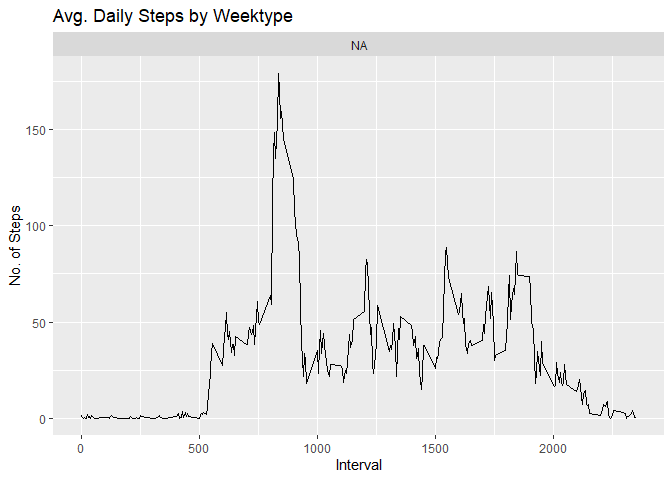

\    <!-- just next line... important see 2 spaces after \ --> 
\  
  
github repo for this project: [https://github.com/LopesDenis/RepData_PeerAssessment1](https://github.com/LopesDenis/RepData_PeerAssessment1)

\  

## Introduction
It is now possible to collect a large amount of data about personal movement using activity monitoring devices such as a Fitbit, Nike Fuelband, or Jawbone Up. These type of devices are part of the “quantified self” movement – a group of enthusiasts who take measurements about themselves regularly to improve their health, to find patterns in their behavior, or because they are tech geeks. But these data remain under-utilized both because the raw data are hard to obtain and there is a lack of statistical methods and software for processing and interpreting the data.

This assignment makes use of data from a personal activity monitoring device. This device collects data at 5 minute intervals through out the day. The data consists of two months of data from an anonymous individual collected during the months of October and November, 2012 and include the number of steps taken in 5 minute intervals each day.

The data for this assignment can be downloaded from the course web site:

* Dataset: [Activity monitoring data](https://d396qusza40orc.cloudfront.net/repdata%2Fdata%2Factivity.zip) 

The variables included in this dataset are:


steps: Number of steps taking in a 5-minute interval (missing values are coded as 𝙽𝙰) </br>

date: The date on which the measurement was taken in YYYY-MM-DD format </br>

interval: Identifier for the 5-minute interval in which measurement was taken </br>

The dataset is stored in a comma-separated-value (CSV) file and there are a total of 17,568 observations in this dataset. 


### Loading and preprocessing the data

Load data.
\  
Important. I'm inside of fork of rep.


```r
library("data.table")
library(ggplot2)


fileUrl <- "https://d396qusza40orc.cloudfront.net/repdata%2Fdata%2Factivity.zip"

download.file(fileUrl, destfile = 'data/repdata%2Fdata%2Factivity.zip', method = "curl")

unzip("data/repdata%2Fdata%2Factivity.zip",exdir = "data")
```

\  
\  

reading data into data.table and initial look at data.


```r
activityDT <- data.table::fread(input = "data/activity.csv")

summary(activityDT)
```

```
##      steps             date               interval     
##  Min.   :  0.00   Min.   :2012-10-01   Min.   :   0.0  
##  1st Qu.:  0.00   1st Qu.:2012-10-16   1st Qu.: 588.8  
##  Median :  0.00   Median :2012-10-31   Median :1177.5  
##  Mean   : 37.38   Mean   :2012-10-31   Mean   :1177.5  
##  3rd Qu.: 12.00   3rd Qu.:2012-11-15   3rd Qu.:1766.2  
##  Max.   :806.00   Max.   :2012-11-30   Max.   :2355.0  
##  NA's   :2304
```


```r
head(activityDT)
```

```
##    steps       date interval
## 1:    NA 2012-10-01        0
## 2:    NA 2012-10-01        5
## 3:    NA 2012-10-01       10
## 4:    NA 2012-10-01       15
## 5:    NA 2012-10-01       20
## 6:    NA 2012-10-01       25
```

I have issue with this mensage

```
Error in tempfile(pattern = "_rs_rdf_", tmpdir = outputFolder, fileext = ".rdf") : temporary name too long
```

\  
to solve this, I use change my work directory

\  
\  
\  

### What is mean total number of steps taken per day?

\  
1. Calculate the total number of steps taken per day


```r
Total_Steps <- activityDT[, c(lapply(.SD, sum, na.rm = FALSE)), .SDcols = c("steps"), by = .(date)] 
head(Total_Steps, 10)
```

```
##           date steps
##  1: 2012-10-01    NA
##  2: 2012-10-02   126
##  3: 2012-10-03 11352
##  4: 2012-10-04 12116
##  5: 2012-10-05 13294
##  6: 2012-10-06 15420
##  7: 2012-10-07 11015
##  8: 2012-10-08    NA
##  9: 2012-10-09 12811
## 10: 2012-10-10  9900
```

\  
\  
2. If you do not understand the difference between a histogram and a barplot, research the difference between them. Make a histogram of the total number of steps taken each day. 


```r
ggplot(Total_Steps, aes(x = steps)) +
    geom_histogram(fill = "blue", binwidth = 1000, na.rm = T) +
    labs(title = "Daily Steps", x = "Steps", y = "Frequency")
```

<!-- -->

\  
\  

3. Calculate and report the mean and median of the total number of steps taken per day

```r
Total_Steps[, .(Mean_Steps = mean(steps, na.rm = TRUE), Median_Steps = median(steps, na.rm = TRUE))]
```

```
##    Mean_Steps Median_Steps
## 1:   10766.19        10765
```


### What is the average daily activity pattern?


1. Make a time series plot (i.e. 𝚝𝚢𝚙𝚎 = "𝚕") of the 5-minute interval (x-axis) and the average number of steps taken, averaged across all days (y-axis)


```r
IntervalDT <- activityDT[, c(lapply(.SD, mean, na.rm = TRUE)), .SDcols = c("steps"), by = .(interval)] 
ggplot(IntervalDT, aes(x = interval , y = steps)) + geom_line(color="blue", size=1) + labs(title = "Avg. Daily Steps", x = "Interval", y = "Avg. Steps per day")
```

<!-- -->

2. Which 5-minute interval, on average across all the days in the dataset, contains the maximum number of steps?


```r
IntervalDT[steps == max(steps), .(max_interval = interval)]
```

```
##    max_interval
## 1:          835
```
\  
\  


### Imputing missing values


1. Calculate and report the total number of missing values in the dataset (i.e. the total number of rows with 𝙽𝙰s)


```r
activityDT[is.na(steps), .N ]
```

```
## [1] 2304
```

```r
# alternative solution
nrow(activityDT[is.na(steps),])
```

```
## [1] 2304
```

2. Devise a strategy for filling in all of the missing values in the dataset. The strategy does not need to be sophisticated. For example, you could use the mean/median for that day, or the mean for that 5-minute interval, etc.


```r
# Filling in missing values with median of dataset. 
activityDT[is.na(steps), "steps"] <- activityDT[, c(lapply(.SD, median, na.rm = TRUE)), .SDcols = c("steps")]
head(activityDT)
```

```
##    steps       date interval
## 1:     0 2012-10-01        0
## 2:     0 2012-10-01        5
## 3:     0 2012-10-01       10
## 4:     0 2012-10-01       15
## 5:     0 2012-10-01       20
## 6:     0 2012-10-01       25
```
\  

3. Create a new dataset that is equal to the original dataset but with the missing data filled in.


```r
data.table::fwrite(x = activityDT, file = "data/tidyData.csv", quote = FALSE)
```

\  


4. Make a histogram of the total number of steps taken each day and calculate and report the mean and median total number of steps taken per day. Do these values differ from the estimates from the first part of the assignment? What is the impact of imputing missing data on the estimates of the total daily number of steps?


```r
# total number of steps taken per day
Total_Steps <- activityDT[, c(lapply(.SD, sum)), .SDcols = c("steps"), by = .(date)] 
# mean and median total number of steps taken per day
Total_Steps[, .(Mean_Steps = mean(steps), Median_Steps = median(steps))]
```

```
##    Mean_Steps Median_Steps
## 1:    9354.23        10395
```

```r
ggplot(Total_Steps, aes(x = steps)) + geom_histogram(fill = "blue", binwidth = 1000) + labs(title = "Daily Steps", x = "Steps", y = "Frequency")
```

<!-- -->
\  

Type of Estimate | Mean_Steps | Median_Steps
--- | --- | ---
First Part (with na) | 10765 | 10765
Second Part (fillin in na with median) | 9354.23 | 10395
\  
\  


### Are there differences in activity patterns between weekdays and weekends?


1. Create a new factor variable in the dataset with two levels – “weekday” and “weekend” indicating whether a given date is a weekday or weekend day.


```r
# Just recreating activityDT from scratch then making the new factor variable. (No need to, just want to be clear on what the entire process is.) 
activityDT <- data.table::fread(input = "data/activity.csv")
activityDT[, date := as.POSIXct(date, format = "%Y-%m-%d")]
activityDT[, `Day of Week`:= weekdays(x = date)]
activityDT[grepl(pattern = "Monday|Tuesday|Wednesday|Thursday|Friday", x = `Day of Week`), "weekday or weekend"] <- "weekday"
activityDT[grepl(pattern = "Saturday|Sunday", x = `Day of Week`), "weekday or weekend"] <- "weekend"
activityDT[, `weekday or weekend` := as.factor(`weekday or weekend`)]
head(activityDT, 10)
```

```
##     steps       date interval   Day of Week weekday or weekend
##  1:    NA 2012-10-01        0 segunda-feira               <NA>
##  2:    NA 2012-10-01        5 segunda-feira               <NA>
##  3:    NA 2012-10-01       10 segunda-feira               <NA>
##  4:    NA 2012-10-01       15 segunda-feira               <NA>
##  5:    NA 2012-10-01       20 segunda-feira               <NA>
##  6:    NA 2012-10-01       25 segunda-feira               <NA>
##  7:    NA 2012-10-01       30 segunda-feira               <NA>
##  8:    NA 2012-10-01       35 segunda-feira               <NA>
##  9:    NA 2012-10-01       40 segunda-feira               <NA>
## 10:    NA 2012-10-01       45 segunda-feira               <NA>
```
\  
\  


2. Make a panel plot containing a time series plot (i.e. 𝚝𝚢𝚙𝚎 = "𝚕") of the 5-minute interval (x-axis) and the average number of steps taken, averaged across all weekday days or weekend days (y-axis). See the README file in the GitHub repository to see an example of what this plot should look like using simulated data.


```r
activityDT[is.na(steps), "steps"] <- activityDT[, c(lapply(.SD, median, na.rm = TRUE)), .SDcols = c("steps")]

IntervalDT <- activityDT[, c(lapply(.SD, mean, na.rm = TRUE)), .SDcols = c("steps"), by = .(interval, `weekday or weekend`)] 

ggplot(IntervalDT , aes(x = interval , y = steps))+ #color = `weekday or weekend`))  +
      geom_line() + 
      labs(title = "Avg. Daily Steps by Weektype", x = "Interval", y = "No. of Steps") + 
      facet_wrap(~`weekday or weekend` , ncol = 1, nrow=2)
```

<!-- -->

```r
str(IntervalDT)
```

```
## Classes 'data.table' and 'data.frame':	288 obs. of  3 variables:
##  $ interval          : int  0 5 10 15 20 25 30 35 40 45 ...
##  $ weekday or weekend: Factor w/ 0 levels: NA NA NA NA NA NA NA NA NA NA ...
##  $ steps             : num  1.4918 0.2951 0.1148 0.1311 0.0656 ...
##  - attr(*, ".internal.selfref")=<externalptr>
```


